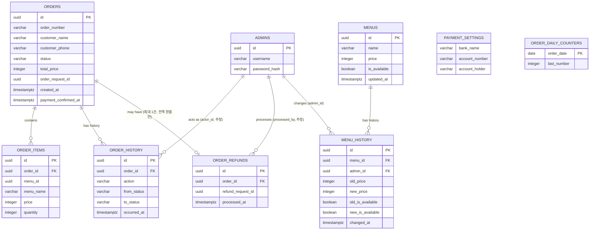

# DB스키마

> v1.1 · 2026-09-18

이 문서는 Backend 1과 Backend 2가 동일한 DB 구조를 기준으로 개발하기 위한 공식 스키마 정의서다.

기존 문서(`docs/backend/001~003`)에 흩어져 있는 컬럼 정보를 모았다. **정확한 타입·제약조건이 기존 문서에서 확정되지 않은 항목은 임의로 확정하지 않고 `TBD`로 표시한다.**

Guest 관련 테이블은 v0.9부터 사용하지 않으므로 이 문서에 포함하지 않는다.

---

# 1. 테이블 목록과 소유권

| Table | Owner | 비고 |
| --- | --- | --- |
| orders | Backend 1 | |
| order_items | Backend 1 | |
| order_history | Backend 1 | |
| order_refunds | Backend 1 | 환불 정책 확정 전까지 컬럼은 후보 단계 |
| order_daily_counters | Backend 1 | 주문번호 발급용 |
| admins | Backend 2 | |
| menus | Backend 2 | |
| payment_settings | Backend 2 | 현재값 한 건만 유지 |
| schema_migrations | 공통 | 실제 관리 방식 TBD (§7 참고) |

Backend 2의 Sales 기능은 `orders`, `order_items`, `order_refunds`를 **읽을 수 있지만 쓸 수 없다.** Backend 2는 `orders`, `order_items`, `order_history`, `order_refunds`, `order_daily_counters`에 직접 쓰지 않는다. Backend 1은 `admins`, `menus`, `payment_settings`를 직접 수정하지 않는다.

---

# 2. orders

고객 식별(이름+전화번호)과 주문 본문을 함께 저장한다. 별도 Guest 테이블이 없으므로 고객 정보는 이 테이블에 직접 들어간다.

| Column | Type | Nullable | Default | Constraint | 설명 |
| --- | --- | --- | --- | --- | --- |
| id | UUID | NO | - | PK | 주문 내부 ID |
| order_number | VARCHAR | NO | - | TBD (UNIQUE 범위 확인 필요, 아래 참고) | 표시용 주문번호, `MMDD-XXXX` |
| customer_name | TBD (VARCHAR 추정) | NO | - | - | 고객 입력 이름 |
| customer_phone | TBD (VARCHAR 추정) | NO | - | - | 고객 입력 전화번호(연락용) |
| status | TBD (VARCHAR 또는 ENUM) | NO | `'PAYMENT_PENDING'` (TBD) | CHECK 또는 ENUM (`OrderStatus` 6종) | 주문 상태 |
| total_price | TBD (INTEGER/BIGINT 추정) | NO | - | CHECK >= 0 (TBD) | 서버가 계산한 최종 금액(원 단위 정수) |
| order_request_id | UUID | NO | - | UNIQUE (전역) | 멱등성 키 |
| request_fingerprint | TBD | TBD | - | - | 같은 `order_request_id`의 내용 충돌 검사용 (도입 여부 자체가 TBD, §12 참고) |
| created_at | TIMESTAMPTZ | NO | `now()` (TBD) | - | 주문 생성 시각 |
| payment_confirmed_at | TIMESTAMPTZ | YES | `NULL` | - | 입금 확인 시각, 확인 전 NULL |

**UNIQUE 관련**

- `order_request_id`: 전역 UNIQUE로 처리한다(Guest 스코프가 없으므로). **확정.**
- `order_number`: `MMDD-XXXX` 형식에 연도가 포함되지 않아 여러 해에 걸쳐 재사용하면 이론적으로 충돌할 수 있으나, 이번 축제는 1회성 운영이므로 **문제 없음으로 확정.** `UNIQUE(order_number)`만으로 충분하다.

**인덱스 후보(TBD, 명시적으로 요구된 문서 없음)**

- `order_number`, `order_request_id`에 대한 인덱스 — lookup 조회(`customer_name` + `order_number`)와 멱등성 검사 성능을 위해 필요할 가능성이 높으나, 정확한 인덱스 설계는 TBD.

---

# 3. order_items

주문 시점의 메뉴 스냅샷을 저장한다. 이후 `menus.price`가 바뀌어도 이 테이블은 갱신하지 않는다.

| Column | Type | Nullable | Default | Constraint | 설명 |
| --- | --- | --- | --- | --- | --- |
| id | UUID | NO | - | PK | |
| order_id | TBD (UUID로 추정, 컬럼명 명시 문서 없음) | NO | - | FK → orders.id (추정) | 소속 주문 |
| menu_id | UUID | NO | - | - | 원본 메뉴 ID(참조용, 주문 당시 정보는 아래 컬럼이 기준) |
| menu_name | TBD (VARCHAR 추정) | NO | - | - | 주문 당시 메뉴명 스냅샷 |
| price | TBD (INTEGER 추정) | NO | - | CHECK >= 0 (TBD) | 주문 당시 단가 스냅샷 (API 응답 필드명은 `unitPrice`) |
| quantity | TBD (INTEGER 추정) | NO | - | CHECK > 0 (TBD) | 수량 |

`order_id` 컬럼명과 FK 제약은 문서에 명시적인 컬럼명으로 등장하지 않아 구조상 필요성에 근거해 추정했다. 실제 구현 전 확인 필요.

---

# 4. order_history

append-only 이력 테이블. 기존 행을 수정/삭제하지 않는다.

| Column | Type | Nullable | Default | Constraint | 설명 |
| --- | --- | --- | --- | --- | --- |
| id | UUID | NO | - | PK | |
| order_id | UUID | NO | - | FK → orders.id (추정) | |
| action | TBD (VARCHAR 추정) | NO | - | - | 예: `ORDER_CREATED`, `PAYMENT_CONFIRMED`, `COOKING_STARTED`, `READY`, `COMPLETED`, `CANCELLED`, `REFUNDED` |
| from_status | TBD | YES | - | - | 상태 변경 이력일 때만 값 존재 |
| to_status | TBD | YES | - | - | |
| actor_type | TBD (VARCHAR 추정) | NO | - | CHECK IN ('CUSTOMER', 'ADMIN') (확정) | `CUSTOMER`(주문 생성) 또는 `ADMIN`(그 외 모든 처리). 자동 전이가 없으므로 `SYSTEM`은 없음 |
| actor_id | TBD | YES | - | - | 관리자 처리 시 `admins.id` |
| occurred_at | TIMESTAMPTZ | NO | `now()` (TBD) | - | |
| reason | TBD (TEXT 추정) | YES | - | - | |
| metadata | TBD (JSONB 추정) | YES | - | - | |

이 테이블 전체가 원문에서 "예시 필드"로만 소개되어 있어, 컬럼 이름과 타입 모두 **최종 확정 전 상태**다.

---

# 5. order_refunds

환불 기록. **정책 확정(전액 환불만, 주문당 1회):**

| Column | Type | Nullable | Default | Constraint | 설명 |
| --- | --- | --- | --- | --- | --- |
| id | UUID | NO | - | PK | |
| order_id | UUID | NO | - | FK → orders.id (추정), **UNIQUE** | 소속 주문. 주문당 최대 1건만 허용(전액 환불만 지원하므로 재환불 불필요) |
| refund_request_id | UUID | NO | - | UNIQUE | 재요청 시 같은 결과를 반환하기 위한 멱등성 키 |
| amount | TBD (INTEGER 추정) | NO | - | - | 항상 해당 주문의 `orders.total_price`와 동일한 값(전액 환불만 지원하므로 별도 입력값이 아니다) |
| processed_at | TIMESTAMPTZ | NO | `now()` (TBD) | - | |
| processed_by | TBD (UUID 추정) | NO | - | FK → admins.id (추정) | |
| reason | TBD (TEXT 추정) | YES | - | - | 직원이 남기는 환불 사유(선택) |

**확정된 정책 (`02_기능명세서.md` 2-7 참고):**

- 입금 확인된 주문(`ACCEPTED`/`COOKING`/`READY`/`COMPLETED`)이면 상태와 무관하게 환불 가능(제조 진행 중이어도 무방).
- 전액 환불만 지원한다. 부분 환불은 없다.
- 환불해도 `OrderStatus`는 바뀌지 않는다(`REFUNDED` 상태를 추가하지 않는다). 조리/수령 흐름도 그대로 진행된다.
- 환불 여부·사유는 `order_history`/`order_refunds` 조회로 확인한다.
- 매출 반영 방식은 `04_DB스키마.md` §9(SalesView 대응) 대신 `03_API명세서.md`의 `SalesView.refundedAmount`를 참고 — 환불 처리일(`processed_at`) 기준으로 그 날짜 통계에 별도 표시한다(원 결제 금액 자체는 건드리지 않는다).

---

# 6. order_daily_counters

주문번호(`MMDD-XXXX`) 발급용 원자적 카운터.

| Column | Type | Nullable | Default | Constraint | 설명 |
| --- | --- | --- | --- | --- | --- |
| order_date | DATE | NO | - | PK / UNIQUE | KST 기준 주문 생성 날짜 |
| last_number | INTEGER | NO | `0` (TBD) | **CHECK (last_number BETWEEN 1 AND 9999)** | 해당 날짜에 마지막으로 발급한 번호 |

`INSERT ... ON CONFLICT (order_date) DO UPDATE ... RETURNING last_number` 형태의 원자적 UPSERT로 갱신한다(`docs/backend/002` §11 참고). 별도의 `id` 컬럼 존재 여부는 문서에 명시되지 않았다(있어도 없어도 되는 구조이므로 TBD).

**9999 초과 처리 (확정):** `last_number`가 9999를 넘어가는 UPSERT는 위 CHECK 제약에 걸려 DB 단에서 거절된다(동시 요청에도 안전). 서비스 레이어는 이 제약 위반을 감지해 `DAILY_ORDER_LIMIT_EXCEEDED`(409, `03_API명세서.md` 참고) 오류로 변환해 응답한다. 하루 9999건을 넘는 것은 실사용상 거의 불가능하다고 보고 별도 자동 확장 로직은 만들지 않는다.

---

# 7. admins

| Column | Type | Nullable | Default | Constraint | 설명 |
| --- | --- | --- | --- | --- | --- |
| id | UUID | NO | - | PK | JWT `sub` 클레임 값 |
| username | TBD (VARCHAR 추정, 컬럼명 확정 아님) | TBD | - | UNIQUE (추정) | 로그인 ID |
| password_hash | TBD (VARCHAR 추정) | NO | - | - | Argon2id 또는 bcrypt 중 택1 해시. 원문 비밀번호는 저장하지 않는다. |

로그인 입력 필드명이 "username"이라는 것은 문서에 등장하지만, 이것이 그대로 DB 컬럼명인지는 확정되어 있지 않다.

---

# 8. menus

| Column | Type | Nullable | Default | Constraint | 설명 |
| --- | --- | --- | --- | --- | --- |
| id | UUID | NO | - | PK | |
| name | TBD (VARCHAR 추정) | NO | - | - | 메뉴명 (수정 불가, 읽기 전용) |
| price | TBD (INTEGER 추정) | NO | - | CHECK >= 0 (TBD) | 현재 가격(원 단위 정수) |
| is_available | BOOLEAN | NO | `true` (TBD) | - | 판매중/품절 |
| updated_at | TIMESTAMPTZ | NO | `now()` | - | `price`/`is_available`이 마지막으로 바뀐 시각(API 응답에는 노출하지 않음, DB 내부 기록용) |

메뉴 추가·삭제·이름 변경 기능은 없다. 관리자가 수정 가능한 값은 `price`, `is_available`뿐이다.

**`updated_at`의 의미 (요청 단위 마커):** `updated_at`은 값이 실제로 달라졌을 때만이 아니라, `PATCH /admin/menus/:menuId` 요청이 유효하게 실행될 때마다 갱신된다(현재 가격과 같은 값으로 다시 PATCH해도 갱신됨 — Repository의 UPDATE 문이 값 비교 없이 항상 실행되는 구조와 일관되게 맞춘 것). 즉 "마지막으로 값이 바뀐 시각"이 아니라 "마지막으로 PATCH 요청이 처리된 시각"에 가깝다. 실제 값 변경 이력이 필요하면 아래 `menu_history`를 본다.

메뉴 사진(이미지) 컬럼은 아직 추가하지 않았다. 저장 방식/CDN 계획은 `docs/backend/11_배포_체크리스트.md` §5에서 확정되었고, 실제 컬럼 추가와 구현은 Step 11(Oracle 배포) 시점으로 보류했다.

---

# 8-1. menu_history

메뉴의 `price`/`is_available`이 **실제로** 바뀔 때마다 변경 전/후 상태를 남기는 감사(audit) 로그다. `updated_at`과 달리 값이 하나라도 달라진 경우에만 행이 생긴다 — 이전과 같은 값으로 보낸 no-op PATCH는 `updated_at`은 갱신하지만 `menu_history`에는 기록을 남기지 않는다.

| Column | Type | Nullable | Default | Constraint | 설명 |
| --- | --- | --- | --- | --- | --- |
| id | UUID | NO | - | PK | |
| menu_id | UUID | NO | - | FK → `menus(id)` | 어떤 메뉴가 바뀌었는지(같은 Backend 소유 테이블 간 FK, `order_items.menu_id`와 달리 여기서는 FK를 건다) |
| admin_id | UUID | NO | - | FK → `admins(id)` | 어떤 관리자가 바꿨는지(`AdminGuard`가 설정한 `request.admin.adminId`) |
| old_price | INTEGER | NO | - | CHECK >= 0 | 변경 전 가격 |
| new_price | INTEGER | NO | - | CHECK >= 0 | 변경 후 가격 |
| old_is_available | BOOLEAN | NO | - | - | 변경 전 판매중/품절 |
| new_is_available | BOOLEAN | NO | - | - | 변경 후 판매중/품절 |
| changed_at | TIMESTAMPTZ | NO | `now()` | - | 변경이 커밋된 시각 |

**기록 단위 (확정):** 한 번의 `PATCH /admin/menus/:menuId` 요청이 `price`와 `is_available`을 동시에 바꿔도 `menu_history`에는 그 요청에 대한 행이 **1건만** 생긴다(필드별로 쪼개지 않음). 그 행에는 두 필드의 변경 전/후 값이 모두 담겨 있어(바뀌지 않은 필드는 이전 값 == 이후 값), 요청 시점의 전체 상태 전환을 그대로 확인할 수 있다.

**Transaction (확정):** `menus` UPDATE와 `menu_history` INSERT는 하나의 Transaction(`DatabaseService.withTransaction`)으로 처리된다. 순서는 다음과 같다.

```text
BEGIN
  SELECT ... FROM menus WHERE id = $1 FOR UPDATE   (변경 전 값 확보 + 잠금)
  UPDATE menus SET ...                              (menus 값 갱신)
  (실제로 값이 달라진 경우에만) INSERT INTO menu_history ...
COMMIT / ROLLBACK
```

`menu_history` INSERT가 실패하면(예: `admin_id`가 `admins`에 없어 FK 위반) 방금 실행한 `menus` UPDATE도 함께 rollback된다 — 메뉴는 바뀌었는데 이력이 없거나, 이력은 생겼는데 메뉴는 안 바뀐 상태는 생기지 않는다.

**조회 API 없음:** 이번 단계에서는 `menu_history`를 읽는 관리자 API/UI를 만들지 않는다. 현재는 DB 내부 감사/추적 기록 용도이며, 필요해지면 별도 조회 API를 추가한다.

FK에 `ON DELETE`를 지정하지 않았다(기본 `NO ACTION`) — `menus`/`admins` 모두 삭제 API가 없어 현재 단계에서는 삭제 시 정책을 고민할 필요가 없다(`order_items.order_id REFERENCES orders(id)`와 동일한 방식).

---

# 9. payment_settings

현재값 한 건만 유지하는 테이블(고객별/주문별 이력 없음).

| Column | Type | Nullable | Default | Constraint | 설명 |
| --- | --- | --- | --- | --- | --- |
| bank_name | TBD (VARCHAR 추정) | NO | - | - | |
| account_number | VARCHAR | NO | - | - | 문자열로 저장(앞자리 0 보존, 숫자형 변환 금지) |
| account_holder | TBD (VARCHAR 추정) | NO | - | - | |
| updated_at | TIMESTAMPTZ | NO | `now()` (TBD) | - | |

이 테이블이 단일 행(싱글턴)인지, PK 컬럼이 별도로 있는지(`id` 또는 고정 값)는 문서에 명시되지 않아 **TBD**. `.env` 초기값은 최초 1회만 사용하며 이후 재시작 시 DB 현재값을 덮어쓰지 않는다.

---

# 10. 관계 (ERD)

문서에서 명시적으로 확인되는 관계만 표시한다. 추측으로 관계를 추가하지 않았다.



`menus`와 `orders`/`order_items` 사이에는 FK를 걸지 않는다. `order_items.menu_id`는 참조용일 뿐이며, 실제 주문 내용의 기준은 스냅샷 컬럼(`menu_name`, `price`)이다 — 메뉴가 삭제/변경되어도 과거 주문에는 영향이 없어야 하기 때문이다(다만 메뉴 삭제 기능 자체가 MVP에 없다).

`menu_history.menu_id`/`admin_id`는 위와 달리 FK를 건다 — `menus`/`admins`/`menu_history` 모두 Backend 2가 소유한 같은 도메인 안의 테이블이기 때문이다(교차 도메인 참조가 아님). `order_items.order_id REFERENCES orders(id)`처럼 같은 Backend 소유 테이블 사이의 참조에는 FK를 쓰는 기존 관례를 그대로 따른다.

`order_daily_counters`는 `orders`와 FK로 연결되지 않는다. 날짜 단위로 독립적으로 관리되는 카운터다.

---

# 11. 공통 규칙 (참고)

아래는 모든 테이블에 공통 적용되는 규칙이다. 자세한 내용은 `docs/backend/001_백엔드_공통.md`를 따른다.

- 내부 ID는 UUID를 기본으로 한다.
- 금액은 원 단위 정수로 저장한다(소수점 없음).
- 시간 컬럼은 `timestamptz`를 기본으로 사용하고, 서비스 날짜 판단은 `Asia/Seoul` 기준으로 한다(서버 OS 타임존에 의존하지 않는다).
- 기간 조회는 `[from, to)` 형태를 사용한다.

---

# 12. Migration

- DB Schema 변경은 SQL Migration 파일로 관리한다.
- **파일명 규칙 (확정, 2026-09-19):** 서로 다른 브랜치의 번호 충돌을 막기 위해 담당 Backend 접두사(`b1_`, `b2_`)를 붙인다(`001_백엔드_공통.md` §47 참고).
- 예상 파일 순서(같은 Backend 안에서는 FK 의존성에 따라 조정 가능):

```text
b2_001_create_admins.sql
b2_002_create_menus.sql
b2_003_add_menus_updated_at.sql
b2_004_create_menu_history.sql
b2_005_create_payment_settings.sql
b1_001_create_orders.sql
b1_002_create_order_items.sql
b1_003_create_order_daily_counters.sql
b1_004_create_order_history.sql
b1_005_create_order_refunds.sql
```

(`b2_003`/`b2_004`는 원래 payment_settings용으로 예상했던 번호였으나, menus `updated_at` 컬럼 추가와 `menu_history` 테이블 생성 migration이 먼저 그 번호들을 사용했다. payment_settings는 다음 번호(`b2_005`)를 사용한다 — 이미 적용된 migration은 수정하지 않으므로 번호를 되돌리지 않는다.)

- `b1_001_create_orders.sql`은 `customer_name`, `customer_phone` 컬럼을 포함한다(Guest 테이블은 만들지 않는다).
- 이미 적용된 Migration 파일은 수정하지 않는다. 변경이 필요하면 새 Migration을 추가한다.
- 성공한 Migration만 기록하고, 실패 시 Rollback한다.
- 실제 Migration 도구(예: `node-pg-migrate`, 자체 스크립트 등)가 무엇인지, 그리고 그 도구가 관리하는 이력 테이블의 정확한 이름/구조(제목에서는 편의상 `schema_migrations`로 불렀다)는 **TBD** — 기존 문서에 도구 자체가 명시되어 있지 않다.

---

# 13. 관련 문서

- `02_기능명세서.md` — 이 데이터가 어떤 기능에 쓰이는지
- `03_API명세서.md` — 이 데이터가 API로 어떻게 노출되는지
- `docs/backend/001_백엔드_공통.md` — 공통 ID/금액/시간 규칙, Transaction 패턴
- `docs/backend/002_백엔드1_주문결제.md` — orders/order_items/order_history/order_refunds 상세 배경
- `docs/backend/003_백엔드2_운영실시간.md` — admins/menus/payment_settings 상세 배경
