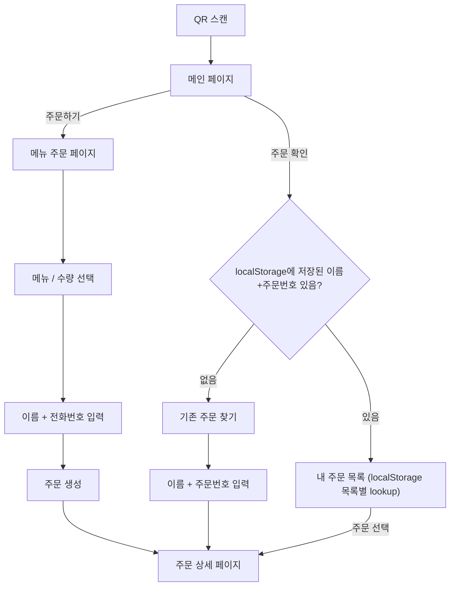

# 학교 축제 QR 주문 프론트엔드 개발 문서

> v0.7 · 2026-09-18 · Next.js + TypeScript + Tailwind CSS
>
> 이 문서에 고객·관리자 화면 개발에 필요한 업무 규칙과 서버 연동 초안을 함께 담는다. **확정**은 합의된 요구사항, **구현 초안**은 개발 제안, **미정**은 추가 결정이 필요한 항목이다. 화면 경로·컴포넌트·API 필드명은 확정 명세가 아니다.

> **v0.5 최종 요구사항 반영:** 주문 찾기는 해당 주문 1건만 조회하며 별도 식별자를 재연결하지 않는다. 매출은 로그인한 운영자 비밀번호로 재확인한다. 입금 후 환불과 전체 처리 이력을 지원한다. 부스 계좌는 DB 현재값을 표시하고 메뉴는 기존 항목의 가격·판매 여부만 변경한다. 환불의 매출 차감·표시 기준은 확정 전이다.

> **v0.6 백엔드 변경 반영:** 백엔드가 Guest 도메인·Guest Cookie를 완전히 제거했다. 고객은 Cookie로 식별되지 않으며, 주문 생성 시 입력한 **이름 + 전화번호**가 `orders` 테이블에 그대로 저장된다. 이후 조회는 언제나 `POST /orders/lookup`(이름 + 주문번호) 하나뿐이다. 서버에는 `GET /orders/me`, `GET /orders/:orderId`, `POST /guests` 같은 세션/식별자 기반 API가 없다. "내 주문 목록"은 서버가 아니라 **프론트엔드 localStorage**에 저장해둔 `{이름, 주문번호}` 목록을 화면에서 각각 lookup 호출해 구성한다.

## 1 서비스와 프론트엔드 책임

QR 첫 화면 → 주문하기 / 주문 확인. 주문하기는 메뉴·수량 선택 → 이름+전화번호 입력 → 주문 생성·주문번호 발급 → 계좌이체 → 현장 입금 확인 → 제조 → 웹에서 준비완료 확인 → 이름+주문번호 확인 후 수령으로 진행한다. 주문 확인은 이름+주문번호로 `POST /orders/lookup`을 호출해 해당 주문 1건을 조회하는 방식뿐이며, 새로고침 시 재입력을 피하기 위해 프론트엔드가 localStorage에 이름+주문번호를 기억해둔다.

프론트엔드는 고객이 휴대전화로 주문·입금 안내·진행 상태를 확인하게 하고, 관리자가 주문·메뉴·매출을 관리할 화면을 제공한다. 주문 생성·입금 확인·매출 접근의 성공 여부는 서버 응답을 기준으로 표시한다.

### 확정 범위

- Next.js + TypeScript + Tailwind CSS.
- REST API 연동, Socket.IO 신규 주문·상태 변경 갱신.
- 고객 Cookie 없음. 주문 생성 시 이름+전화번호를 직접 입력해 저장하고, 조회는 이름+주문번호 lookup 하나뿐이다. localStorage에 이름+주문번호를 저장해 재접속 시 자동으로 다시 조회한다.
- 운영자 JWT는 HttpOnly Cookie에 저장하고 12시간 후 만료·재로그인. 매출은 진입할 때마다 비밀번호 입력 후 같은 요청으로 조회.
- QR 첫 화면은 주문하기 / 주문 확인 두 버튼.
- 웹 현황 화면에서 Socket.IO로 상태 갱신, 재접속 시 REST API로 최신 상태 조회. 외부 알림은 MVP 제외.

### 제외 범위

온라인 PG 결제창, 고객 회원가입·학번 인증, 별도 확인번호 입력은 만들지 않는다. Prisma·Redis·Kafka·RabbitMQ도 현재 시스템에 도입하지 않는다. 자동 재고 수량 관리와 미입금 자동 삭제도 하지 않는다. SMS·Web Push·카카오 알림·PushSubscription·Service Worker/PWA 알림 처리도 제외한다. 전화번호는 주문 생성 시 입력받지만 SMS·알림 발송용이 아니라 연락처 목적일 뿐이며, 위 알림 제외 항목과는 무관하다.

## 2 화면 구성 — 구현 초안

| 화면 경로 제안 | 화면 | 핵심 역할 |
| --- | --- | --- |
| / | QR 첫 화면 | 부스 이름과 주문하기 / 주문 확인 두 버튼 |
| /order | 메뉴 주문 | 메뉴·가격·품절 표시, 수량 선택 → 이름+전화번호 입력 → 제출 |
| /my-orders | 내 주문 | localStorage에 저장된 이름+주문번호 목록을 각각 lookup으로 재조회해 보여줌 |
| /orders/:orderId | 주문 상세 | 주문 생성/lookup 응답으로 채워짐. 주문번호·금액·입금 안내·진행 상태 |
| /find-order | 기존 주문 찾기 | 이름+주문번호로 해당 주문 1건만 조회 |
| /admin/login | 관리자 로그인 | 관리자 인증 |
| /admin/orders | 관리자 주문 | 신규 주문 확인, 입금 확인 및 상태 변경 |
| /admin/menu | 메뉴 관리 | 기존 메뉴 가격·판매 가능 여부만 수정 |
| /admin/sales | 판매 통계 | 진입마다 비밀번호 입력 및 통계 조회 |
| /admin/settings/payment | 계좌 설정 | 은행·계좌번호·예금주 변경, 일반 운영자 사용 |

orderId는 내부 ID다. 고객에게는 orderNumber를 크게 보여준다. 서버에는 `GET /orders/:orderId` 같은 ID 기반 단건 조회 API가 없으므로, 주문 상세 주소를 안다는 사실만으로는 주문 데이터를 가져올 수 없다. 화면 데이터는 항상 주문 생성 응답 또는 `POST /orders/lookup`(이름+주문번호) 응답으로 채운다.

## 2-1 흐름도


## 고객용 페이지 구조

```text
/
├── 주문하기
│   └── /order
│       └── /orders/:id
│
└── 주문 확인
    ├── /my-orders
    │   └── /orders/:id
    │
    └── /find-order
        └── /orders/:id
```

## 3 고객 화면 상세

### QR 첫 화면 — 확정

QR은 첫 화면으로 연결한다. 부스 이름과 **주문하기 / 주문 확인** 두 버튼을 표시한다. 고객 Cookie가 없으므로 서버 쪽 식별 상태를 먼저 확인하는 절차 없이 항상 같은 두 버튼을 보여준다. 부스 이름은 실제 운영 명칭을 사용한다.

```text
QR → 첫 화면
      ├─ 주문하기 → 메뉴 선택 → 이름 + 전화번호 입력 → 주문 생성 → 계좌이체 안내
      └─ 주문 확인 → localStorage에 저장된 이름+주문번호 확인
                       ├─ 있음 → 저장된 목록별 lookup 재조회 → 주문 상세
                       └─ 없음 → 기존 주문 찾기 → 이름 + 주문번호
```

첫 화면에 진행 중 주문을 미리 보여주는 기능은 선택적 후속 개선이며 MVP에는 포함하지 않는다. 알림 발송 여부 안내, 수신 가능 여부 배지, 알림 권한·설치 화면은 넣지 않는다.

### 주문하기 분기

서버는 별도의 "손님 등록" 단계나 식별자를 발급하지 않는다. 고객은 메뉴·수량을 먼저 고른 뒤 제출 직전에 이름+전화번호를 입력하고, 이 값이 그대로 `POST /orders` 요청에 담겨 주문 생성과 동시에 저장된다. 재주문(두 번째 주문)에도 기존 식별자를 재사용하지 않고 매번 새로 이름+전화번호를 입력받는다.

주문 생성에 성공하면 프론트엔드가 localStorage에 `{customerName, orderNumber}`를 추가로 저장해, 다음에 "주문 확인"을 누를 때 자동으로 다시 조회할 수 있게 한다. 이 저장은 서버 세션이 아니라 브라우저 로컬 상태일 뿐이다.

### 주문 확인 분기와 재접속

- 주문 확인 버튼을 누르면 localStorage에 저장된 이름+주문번호 목록이 있는지 먼저 확인한다.
- 목록이 있으면 이름·주문번호를 다시 입력받지 않고 각 항목에 대해 `POST /orders/lookup`을 호출해 내 주문 목록을 구성한다.
- localStorage에 저장된 값이 없으면(다른 기기·브라우저 접속, 캐시 삭제 등) 이름+주문번호 찾기 화면을 제공한다.
- localStorage 목록의 항목이 서버에서 더 이상 조회되지 않으면(예: 데이터 보관 기간 만료) 해당 항목만 목록에서 제외하고 나머지는 정상 표시한다. 이를 전체 조회 실패로 취급하지 않는다.
- lookup 요청 중·성공·실패(불일치)·네트워크 오류를 구분한다. 네트워크 오류는 "조회 결과 없음"으로 오인하지 않고 재시도를 제공한다.
- 페이지를 닫았다 열거나 주문 상세로 직접 진입하면 같은 이름+주문번호로 lookup을 다시 호출해 최신 상태를 가져온다. 휴대전화에서 화면으로 돌아오거나 소켓이 재연결되는 경우도 동일하게 재조회하는 구현 초안을 적용한다.

**확정:** 주문 찾기는 일치 주문 1건만 조회하며 별도 식별자를 발급·재연결하거나 전체 주문 접근 권한을 복구하지 않는다. 동명이인을 이름만으로 연결하지 않는다. 축제 종료 후 보관 기간은 운영 설정 사항이다.

### 메뉴 주문

표시 항목은 메뉴명, 현재 가격, 판매중·품절, 수량, 선택 내역과 예상 총액, 주문하기 버튼이다.

- 운영자가 품절 처리한 메뉴는 선택하지 못하게 한다. 재고 개수·자동 잔여 수량은 표시하지 않는다.
- 빈 주문과 0 이하 수량을 막고 양의 정수 수량을 보낸다.
- 새 주문 시도에 UUID `orderRequestId`를 한 번 만들고 items(menuId, quantity)와 함께 보낸다.
- 처리 중 버튼을 잠근다. 네트워크 오류·타임아웃 재시도에는 **같은 요청 ID와 같은 주문 내용**을 사용한다.
- 주문 성공 뒤 실제로 새 주문을 시작할 때는 새 ID를 만든다. 재시도 버튼마다 새 ID를 생성하지 않는다.
- 성공 후 서버 응답의 주문번호·최종 총액을 표시한다. 중복 재시도로 기존 주문이 돌아와도 같은 상세로 이동한다.
- 응답이 유실되면 무조건 새 주문을 만들지 않고 동일 요청 재시도 또는 내 주문 확인으로 처리 결과를 확인한다.
- 같은 ID로 다른 내용을 전송한 충돌 응답은 자동 재시도하지 않고 기존 주문을 확인하도록 한다.

**가격 확정 규칙:** 제출 순간 서버 DB 가격이 최종 가격이다. 화면이 3,500원이어도 서버가 3,000원으로 바뀌었다면 3,000원으로 생성하고 최종 금액을 보여준다. 인상도 같은 기준이며 가격 변경 별도 재동의 단계는 두지 않는다. 이미 저장된 주문 재시도에는 당시 가격이 유지된다.

**품절:** 서버가 제출 순간 품절을 반환하면 선택 내용을 유지한 채 메뉴를 갱신하고 수정하도록 안내한다. 서버 중복 방지는 UNIQUE+트랜잭션으로 함께 처리하며 버튼 잠금만으로 대체하지 않는다.

**구현 초안:** 응답 미확인 중인 요청 ID와 항목은 재렌더링에도 유지하고 재시도에서 재사용한다. 새로고침을 포함한 복구를 위해 세션 저장 등 보관 방식을 상세 설계에서 선택한다. 이는 주문 완료 후 저장하는 이름+주문번호 localStorage 항목과는 별개다. 수량 상한은 별도로 두지 않는다(품절 처리로 대응, 확정). **미정:** 장바구니·미완료 요청의 새로고침 복원 방식.

### 주문 상세 및 입금 안내

항상 `MMDD-XXXX` 주문번호(예: `0916-0001`), 고객 이름, 주문 당시 메뉴명·단가·수량, 최종 총액, 현재 상태, 주문 시각을 확인할 수 있게 한다. 번호는 서버가 일별로 발급하며 프론트에서 생성하지 않는다.

PAYMENT_PENDING에서는 은행·계좌번호·예금주·이체금액과 다음 안내를 표시한다.

> 계좌이체 후 부스에서 주문번호와 이체 완료 화면을 보여주세요. 직원이 확인하면 주문이 접수됩니다.

계좌는 DB 설정을 조회하는 `GET /settings/payment`로 받아 표시한다. 은행·계좌번호·예금주를 하드코딩하지 않는다. 운영자의 계좌 변경은 재배포 없이 반영한다. 기존 주문도 현재 부스 입금 계좌를 표시한다. 주문별 과거 계좌 스냅샷은 없으며 고객 계좌는 입력받지 않는다. 계좌 조회 캐시를 갱신해 운영자가 바꾼 현재값이 반영되도록 한다. 고객 화면에 입금 확인을 완료하는 버튼은 만들지 않는다. 주문 생성 성공을 결제 완료로 표현하지 않는다.

### 주문 생성 후 상태 확인 안내 — 문구 초안

주문 생성 직후는 PAYMENT_PENDING이므로 입금 확인·접수가 끝난 것으로 표현하지 않는다.

> 주문이 등록되었습니다. 계좌이체 후 부스에서 주문번호와 이체내역을 보여주세요.
> 주문 현황 페이지에서 준비 상태를 확인해주세요.
> 페이지를 닫아도 다시 접속하면 주문 상태를 확인할 수 있습니다.

운영자가 입금 확인한 ACCEPTED부터 “주문이 접수되었습니다”를 사용할 수 있다. 화면에는 현재 상태와 다음 행동만 안내하며 알림이 간다·안 간다는 별도 설명은 넣지 않는다. READY는 준비완료, COMPLETED는 수령완료로 구분한다.

### 상태별 표시 — 확정 의미, 문구 초안

| 서버 상태 | 고객 표시 | 안내 문구 초안 |
| --- | --- | --- |
| PAYMENT_PENDING | 입금 확인 대기 | 계좌이체 후 부스에서 주문번호와 이체내역을 보여주세요. |
| ACCEPTED | 접수 완료 | 입금 확인이 끝났습니다. 제조를 기다려주세요. |
| COOKING | 제조 중 | 주문하신 메뉴를 만들고 있습니다. |
| READY | 준비완료 | 부스에서 이름과 주문번호를 알려주고 수령해주세요. |
| COMPLETED | 수령 완료 | 주문하신 제품을 수령했습니다. |
| CANCELLED | 취소됨 | 취소된 주문입니다. 문의는 부스 운영자에게 해주세요. |

서버 상태를 임의로 앞당겨 표시하지 않는다. 예상 대기시간·순번·제조시간 계산은 현재 확정 기능이 아니다.

### 주문 상세 및 주문 상태 표시

주문 생성 이후 고객은 주문 상세 페이지에서 주문번호, 결제 정보 및 현재 주문 상태를 확인한다.

#### 주문 상태 진행바

고객에게는 주문 진행 상태를 가로형 진행바(Stepper)로 표시한다.

```text
●────────○────────○────────○
입금 대기      접수 완료       제조 중       준비 완료
```

주문 상태가 변경될 때마다 완료된 단계까지 진행바를 활성화한다.

예시 - 제조 중:

```text
●────────●────────●────────○
입금 대기      접수 완료       제조 중       준비 완료
```

예시 - 준비 완료:

```text
●────────●────────●────────●
입금 대기      접수 완료       제조 중       준비 완료
```

진행바에는 다음 4단계만 표시한다.

1. 입금 대기 (`PAYMENT_PENDING`)
2. 접수 완료 (`ACCEPTED`)
3. 제조 중 (`COOKING`)
4. 준비 완료 (`READY`)

`COMPLETED`는 진행바의 별도 단계로 추가하지 않는다.

#### 상태별 안내 문구

현재 주문 상태에 따라 진행바 상단의 안내 문구를 변경한다.

- `PAYMENT_PENDING` : **입금 확인을 기다리고 있어요**
- `ACCEPTED` : **주문이 접수되었어요**
- `COOKING` : **주문하신 메뉴를 만들고 있어요**
- `READY` : **준비가 완료되었어요! 부스에서 받아주세요**
- `COMPLETED` : **수령 완료 / 주문이 정상적으로 완료되었어요**

#### 수령 완료 처리

고객이 상품을 수령하고 운영자가 주문을 `COMPLETED` 상태로 변경하면 진행바는 4단계가 모두 완료된 상태로 유지한다.

진행바 위에는 별도로 **수령 완료** 상태를 표시한다.

```text
✓ 수령 완료

주문이 정상적으로 완료되었어요.

●────────●────────●────────●
입금 대기      접수 완료       제조 중       준비 완료
```

이를 통해 조리 및 준비 과정은 4단계 진행바로 단순하게 유지하면서, 이미 수령한 과거 주문을 다시 조회했을 때도 주문이 실제로 완료된 주문인지 명확하게 확인할 수 있도록 한다.

#### 입금 정보 표시

`PAYMENT_PENDING` 상태에서는 고객이 계좌이체를 진행할 수 있도록 다음 정보를 표시한다.

- 결제 금액
- 은행명
- 계좌번호
- 예금주
- 계좌번호 복사 버튼

운영자가 입금을 확인하여 주문이 `ACCEPTED` 상태로 변경된 이후에는 계좌 정보를 주요 정보 영역에서 숨기거나 축소하고, 주문 진행 상태를 중심으로 표시한다.

#### 실시간 상태 반영

주문 상세 페이지가 열려 있는 동안 Socket.IO를 통해 주문 상태 변경을 감지한다.

상태 변경 이벤트를 수신하면 저장해둔 이름+주문번호로 `POST /orders/lookup`을 다시 호출해 진행바와 상태 안내 문구를 갱신한다.

페이지를 닫았다가 다시 접속한 경우에도 같은 이름+주문번호로 lookup을 다시 호출해 최신 상태를 표시한다. 서버에는 orderId만으로 재조회하는 API가 없다.

### 내 주문

QR 재접속 후 주문 확인을 선택하면 localStorage에 저장된 이름+주문번호 목록을 읽어 각 항목에 대해 `POST /orders/lookup`을 호출하고 결과를 모아 목록으로 보여준다. 서버가 "내 주문 전체"를 한 번에 반환하는 API는 없다. 내 주문·상세 화면으로 직접 재진입한 경우에도 같은 방식으로 lookup을 다시 호출해 최신 상태를 가져온다. 각 항목에는 주문번호, 상태, 주문 내역 요약, 금액 및 상세 진입을 제공한다. 저장된 목록이 없으면 메뉴 주문으로 이동할 수 있게 한다.

CANCELLED 주문은 진행 중과 구분하며 자동으로 새 주문을 만들지 않는다. 정렬 순서와 완료·취소 주문 표시 기간은 미정이다. 목록·상세에 표시된 상태가 달라지면 서버 재조회로 맞춘다. localStorage에 남아있던 항목이 서버에서 더 이상 조회되지 않으면 해당 항목만 조용히 목록에서 제외한다.

### 기존 주문 찾기

- 입력은 이름과 주문번호 두 가지다. 확인번호나 학번을 추가하지 않는다.
- 조회 성공 시 해당 주문을 보여주고, localStorage의 이름+주문번호 목록에도 추가해 다음 "주문 확인"부터는 자동으로 뜨게 한다. MMDD-XXXX를 연도와 무관한 영구 고유번호로 간주하지 않는다. 조회 축제 범위는 서버 정책을 따른다.
- 불일치 시 이름과 주문번호를 다시 확인하도록 안내한다.
- 조회 중 버튼을 비활성화하고 네트워크 오류는 조회 불일치와 구분한다.

이름+주문번호 일치 시 그 주문 하나만 보여준다. 별도 식별자를 발급·재연결하거나 내 주문 전체가 복구됐다고 안내하지 않는다. 찾은 화면의 REST 재조회는 같은 이름+주문번호로 다시 요청하는 초안을 사용한다. 소켓 구독도 REST lookup과 동일하게 이름+주문번호를 함께 제시해야 하며, 내부 orderId만으로는 구독을 허용하지 않는다(`01_백엔드_공통.md` §38 참고). 새로고침 시에도 다시 이름+주문번호를 lookup하며, Cookie 기반 전체 복구 같은 우회 수단은 없다.

## 4 관리자 화면 상세

### 로그인 및 운영 권한

ID/PW를 보내면 서버가 유효기간 **12시간의 JWT를 HttpOnly Cookie**로 설정한다. 프론트 JavaScript가 JWT를 읽거나 localStorage에 복사하지 않는다. 12시간이 지나면 재로그인하며 자동 연장·refresh token 흐름은 추가하지 않는다.

API 인증 만료 응답을 받으면 관리자 데이터·소켓 구독을 정리하고 로그인 화면으로 이동한다. 로그아웃은 서버에 Cookie 삭제를 요청한 뒤 같은 정리를 한다. HttpOnly Cookie 삭제는 프론트 코드에서 직접 처리하지 않는다.

일반 운영자는 로그인만 하면 주문·입금 확인·제조 상태·취소·환불·처리 이력·기존 메뉴 가격·품절·부스 계좌정보를 관리한다. 매출통계만 비밀번호를 추가 입력한다. 운영 기능마다 별도 역할 제한이나 매출 비밀번호를 요구하지 않는다.

Cookie를 보내는 요청 구성을 맞추고, 교차 출처이면 credentials와 서버 허용 Origin을 함께 설정한다. 운영자 로그인 결과는 서버 인증 응답으로 판단한다.

### 주문 관리

표시 항목: 주문번호, 이름, 전화번호, 메뉴·수량, 주문 금액, 주문 시각, 현재 상태. 전화번호는 미수령 고객에게 연락할 때 사용한다(`AdminOrderView.customerPhone`, 고객 본인이 보는 화면에는 표시되지 않는다). 현장 이체금액 대조에 필요한 개별 주문 금액은 표시하되, 전체 매출 통계는 이 화면에 넣지 않는다.

| 현재 상태 | 버튼 문구 초안 | 서버 처리 |
| --- | --- | --- |
| PAYMENT_PENDING | 입금 확인 / 미입금·취소 | 각각 ACCEPTED 또는 CANCELLED |
| ACCEPTED | 제조 시작 / 환불 처리 | 제조 전환 또는 환불 기록 |
| COOKING | 준비완료 / 환불 처리 | 준비완료 전환 또는 환불 기록 |
| READY | 수령완료 / 환불 처리 | 수령완료 전환 또는 환불 기록 |
| COMPLETED | 환불 처리 | 수령완료 상태에서도 환불 가능 |
| CANCELLED | 없음 | 취소 표시 |

입금 확인은 직원이 현장에서 주문번호와 이체내역을 확인한 뒤 누른다. 고객의 요청만으로 자동 처리하지 않는다. 신규 주문은 Socket.IO로 감지해 새로고침 없이 목록에 반영한다.

**구현 초안:** 처리 중 해당 주문 버튼을 잠그고, 서버 성공 후 상태를 바꾼다. 다른 직원이 먼저 처리해 충돌하면 최신 상태를 재조회한다. READY 전환 성공 후 연결 중인 고객 화면에 준비완료가 반영된다. 외부 알림 발송 결과·재발송 버튼은 만들지 않는다.

미입금은 일정 시간이 지나도 자동 삭제·자동 취소하지 않는다. 운영자가 실제 이체 여부를 확인한 후 미입금/취소를 누른다. 이번 구현 초안은 PAYMENT_PENDING에서 CANCELLED로의 수동 취소다. 입금 확인과 취소가 경합하면 서버 결과를 재조회한다. 취소를 고객 자동 처리 버튼으로 제공하지 않는다.

### 환불 처리와 주문 이력

**확정:** ACCEPTED / COOKING / READY / COMPLETED 주문에서 운영자 환불 처리를 제공한다. 고객이 직접 환불 완료 상태를 만드는 버튼은 없다. 주문 생성·입금 확인·제조·준비완료·수령완료·취소·환불의 모든 처리 이력을 운영자 주문 상세에 표시한다.

기존 메뉴명·단가·주문 총액·입금 확인 기록을 삭제하거나 0원으로 바꾸지 않는다. 환불 결과와 금액·시각 등을 별도로 표시한다. 처리 이력에는 처리 종류·이전/다음 상태·시각·처리자를 보여주는 초안을 사용한다.

**구현 초안:** 환불 처리 중 버튼을 잠그고 서버 성공 뒤에만 반영한다. 실제 송금 자동화가 없는 시스템이므로 버튼만으로 돈이 반환된다고 안내하지 않는다. 고객 계좌를 입력받지 않는다. 재요청·동시 처리 시 중복 기록 방지 결과를 따르고 서버 상태를 재조회한다.

**확정(2026-09-18):** 전액 환불만 지원한다(부분 환불 없음). 환불해도 주문 상태(6개 값)는 바뀌지 않으며 별도 `REFUNDED` 상태를 추가하지 않는다. 조리·수령 버튼은 환불과 무관하게 그대로 동작한다. 환불 여부·사유·처리자는 화면에서 처리 이력(`GET /admin/orders/:orderId/history`)으로 확인한다. **미정:** 입력·확인 UI 세부 디자인.

### 메뉴 관리 — 확정

메뉴 종류는 이미 정해져 있다. 운영 화면은 기존 메뉴명·가격·판매 여부를 조회하며 **가격 변경 + 판매중/품절 변경만** 가능하다. 메뉴 추가·삭제·이름 변경 버튼과 API 호출은 만들지 않는다. 메뉴명은 읽기 전용이다. 자동 재고 수량 관리도 없다.

저장 중·완료·실패를 구분하고 서버 성공 후 반영한다. 변경 이후 새 주문에만 새 가격을 적용하며 기존 주문에는 당시 메뉴명·가격을 유지한다. 확정 메뉴 목록은 초기 데이터로 연동하고 임의로 종류를 추가하지 않는다.

### 계좌 설정

`/admin/settings/payment`에서 현재 은행·계좌번호·예금주를 조회·수정한다. 로그인한 일반 운영자 모두 사용할 수 있고 매출 비밀번호는 요구하지 않는다.

입력 필드는 bankName, accountNumber, accountHolder 초안을 사용한다. 계좌번호는 숫자형 변환 없이 문자열로 다뤄 앞자리 0을 보존한다. 저장 중·실패·성공을 구분하고 서버 저장 후 현재 값을 다시 확인한다. 고객 화면은 서버 DB 설정을 조회한다. 기존 미입금 주문에도 현재 부스 계좌를 표시한다. 고객 계좌 입력과 주문별 과거 계좌 스냅샷은 없다. `.env` 기본값이 있더라도 운영 중 현재값은 DB다.

### 판매 통계

1. `/admin/sales` 진입마다 현재 로그인한 운영자 계정의 비밀번호를 다시 입력받는다. 별도 매출 PW는 없으며 로그인 JWT도 유효해야 한다.
2. `POST /admin/sales/query` 요청 본문에 password를 보내면 서버가 검증하고 **같은 응답으로 통계 전체를 반환**한다.
3. 응답을 받아 오늘·축제 전체·일자별·메뉴별을 표시하고 입력한 비밀번호는 즉시 지운다.
4. 같은 페이지의 탭 전환은 받은 데이터로 처리한다. 새로운 서버 조회·새로고침·페이지 재진입은 비밀번호를 다시 받는다.
5. 페이지를 나가거나 로그아웃·JWT 만료 시 비밀번호와 통계 데이터를 정리한다.

별도 매출 인증 유지 시간, SALES_VIEWER 토큰, 매출 세션은 없다. verify 후 비밀번호 없이 GET하는 2단계 방식도 사용하지 않는다. 비밀번호를 저장해 백그라운드 자동 조회하거나 URL에 넣지 않는다.

**구현 초안:** 통계는 페이지 메모리에만 두고 공유 조회 캐시·localStorage·sessionStorage에 보관하지 않는다. 뒤로가기·페이지 복원에서도 이전 통계를 자동 노출하지 않고 진입 잠금으로 돌아간다. 새 조회 실패 시 이전 데이터를 최신 결과로 표시하지 않는다. 마지막 조회 시각(asOf)을 보여준다.

| 영역 | 필수 표시 |
| --- | --- |
| 오늘 | KST 오늘의 입금 확인된 판매수량·판매금액 |
| 축제 전체 | 설정된 축제 기간 누적 판매수량·판매금액 |
| 일자별 | 입금 확인일별 날짜·판매수량·판매금액 |
| 메뉴별 | 오늘 및 축제 전체 메뉴별 판매수량·판매금액 초안 |

매출 기준은 **Asia/Seoul(KST) + payment_confirmed_at**이다. 9/16 23:58 주문이 9/17 00:01 입금 확인되면 9/17 매출이다. 브라우저 현지 시간대로 날짜를 다시 나누지 않는다.

PAYMENT_PENDING과 미입금 CANCELLED는 원 결제 집계에서 제외한다. 입금 확인 기록은 수령 전에도 원 결제에 포함하며 환불로 주문 상태가 달라져도 원 결제 기록을 보존한다. 수량은 상품 개수이고 금액은 주문 당시 단가 기준이다. 프론트 임의 계산 대신 서버 집계 응답을 표시한다.

**환불 매출 표시(확정):** 서버 응답의 `amount`는 원 결제액이며 환불 여부와 무관하게 그대로 유지한다. 서버가 각 구간(오늘/축제전체/일자별)에 `refundedAmount`(그 날짜에 환불 처리된 금액 합계)를 추가로 내려주며, 화면에서 순매출을 보여줘야 하면 `amount - refundedAmount`로 계산한다. 메뉴별(`byMenu`) 통계에는 환불 배분을 표시하지 않는다(전액 환불만 지원하므로 메뉴별 분배 자체가 없다).

매출 없음은 0·빈 결과로 표시하고 로딩·오류와 구분한다. 실제 축제 기간은 운영 설정으로 정한다. 비밀번호 검증 대상은 현재 로그인한 운영자 계정으로 확정이다. 차트·CSV 다운로드는 필수 기능이 아니다.

## 5 서버 연동 초안

백엔드 문서와 동일한 초안이다. Cookie 정책과 확정된 업무 규칙을 따르며 세부 API 이름·응답 구조는 연동 시 맞춘다.

| 메서드·경로 초안 | 접근 주체 | 입력 핵심 | 응답·동작 |
| --- | --- | --- | --- |
| GET /menus | 고객 | 없음 | 메뉴·현재 가격·판매 여부 |
| GET /settings/payment | 고객 | 없음 | DB에 저장된 은행·계좌번호·예금주 |
| POST /orders | 고객 | orderRequestId, customerName, customerPhone, items: menuId, quantity | 새 주문 또는 동일 요청의 기존 주문. 응답에 주문 상세가 포함되어 별도 단건 조회가 필요 없다 |
| POST /orders/lookup | 고객 | customerName, orderNumber | 일치하는 주문 1건만 조회. 별도 식별자 발급·재연결 및 전체 주문 복구 없음. `GET /orders/me`, `GET /orders/:orderId` 같은 세션/ID 기반 조회 API는 없다 |
| POST /admin/auth/login | 운영자 | username, password | 12시간 JWT를 HttpOnly Cookie로 설정 |
| POST /admin/auth/logout | 운영자 | 없음 | JWT Cookie 삭제 |
| GET /admin/orders | 운영자 JWT Cookie | cursor, limit(기본 20 최대 50) | 최신 생성순 주문 목록(커서 페이지네이션), `customerPhone` 포함 |
| POST /admin/orders/:orderId/payment-confirmation | 운영자 | 내부 orderId | ACCEPTED 전환 및 payment_confirmed_at 기록 |
| PATCH /admin/orders/:orderId/status | 운영자 | status | COOKING·READY·COMPLETED 기본 전환 |
| POST /admin/orders/:orderId/cancel | 운영자 | 내부 orderId | PAYMENT_PENDING → CANCELLED 수동 취소 초안 |
| POST /admin/orders/:orderId/refunds | 운영자 | refundRequestId, reason(선택) | 전액 환불 처리(부분 환불 없음), 주문당 1건, OrderStatus 변경 없음 |
| GET /admin/orders/:orderId/history | 운영자 | 내부 orderId | 생성부터 환불까지 순서대로 처리 이력 조회 |
| GET /admin/menus | 운영자 | 없음 | 관리용 메뉴 목록 |
| PATCH /admin/menus/:menuId | 운영자 | price, isAvailable 중 변경값 | 기존 메뉴 가격·판매 여부만 수정. 이름·추가·삭제 불가 |
| GET /admin/settings/payment | 운영자 | 없음 | 현재 계좌 설정 |
| PATCH /admin/settings/payment | 운영자 | bankName, accountNumber, accountHolder | DB 계좌 설정 수정. 매출 비밀번호 불필요 |
| POST /admin/sales/query | 운영자 JWT + 본인 비밀번호 | password | JWT로 식별한 현재 운영자 계정 비밀번호 검증 후 통계 반환 |

API 경로·필드명·메서드는 연동 초안이다. 메뉴 등록·삭제·이름 변경 API는 제공하지 않는다. 입금 확인을 일반 상태 수정 API로 우회할 수 없게 한다. 고객은 Cookie를 사용하지 않으며 이름+주문번호로만 접근 범위를 검증받는다. 운영자만 JWT HttpOnly Cookie를 사용한다.

**매출 연동 변경:** 별도 `/admin/sales/verify`와 뒤이은 비밀번호 없는 GET 조회 방식은 사용하지 않는다. 매출 조회 요청마다 비밀번호를 검증하고 같은 응답에 통계를 반환한다. 매출용 JWT·유지 세션은 만들지 않는다. 비밀번호를 URL·로그에 넣지 않는다.

### 공유 데이터 형태 — 구현 초안

```ts
type OrderStatus =
  | 'PAYMENT_PENDING' | 'ACCEPTED' | 'COOKING'
  | 'READY' | 'COMPLETED' | 'CANCELLED';

type CreateOrderInput = {
  orderRequestId: string; // 한 번의 주문 시도에 발급한 UUID. 재시도 시 유지
  customerName: string;
  customerPhone: string; // 미수령 시 연락용. SMS·알림 발송에는 사용하지 않음
  items: { menuId: string; quantity: number }[];
};

type OrderLookupInput = {
  customerName: string;
  orderNumber: string;
};

type MenuView = {
  id: string;
  name: string;
  price: number; // 원 단위 정수
  isAvailable: boolean;
};

type PaymentSettingsView = {
  bankName: string;
  accountNumber: string;
  accountHolder: string;
};

type OrderItemView = {
  menuId: string;
  menuName: string; // 주문 당시 이름
  unitPrice: number; // 주문 당시 서버 DB 가격
  quantity: number;
};

type OrderView = {
  id: string;
  orderNumber: string; // MMDD-XXXX, 예: 0916-0001
  customerName: string;
  status: OrderStatus;
  items: OrderItemView[];
  totalPrice: number;
  createdAt: string;
  paymentConfirmedAt: string | null; // 입금 확인 시각, 확인 전 null
  // 환불 여부는 이 타입에 없다. 관리자는 history 조회로 확인한다(고객용 응답이므로 전화번호도 없음).
};

// 관리자 전용 응답(고객용 OrderView + 전화번호). GET /admin/orders 및 관리자 상태변경 API 응답에 사용.
type AdminOrderView = OrderView & {
  customerPhone: string;
};

type SalesTotals = { quantity: number; amount: number };
type SalesTotalsWithRefund = SalesTotals & { refundedAmount: number }; // amount는 원 결제액 그대로, refundedAmount는 그 날짜에 처리된 환불액
type SalesView = {
  timezone: 'Asia/Seoul';
  basis: 'payment_confirmed_at';
  asOf: string;
  festivalPeriod: { from: string; to: string }; // 시작 포함, 끝 제외
  today: SalesTotalsWithRefund & { date: string };
  festival: SalesTotalsWithRefund;
  daily: (SalesTotalsWithRefund & { date: string })[]; // 축제 기간
  byMenu: { // 메뉴별 환불 배분은 지원하지 않으므로 refundedAmount 없음
    today: (SalesTotals & { menuId: string; menuName: string })[];
    festival: (SalesTotals & { menuId: string; menuName: string })[];
  };
};
```

시각은 시간대 정보가 있는 ISO 8601 문자열, API ID는 문자열로 표현하는 초안이다. DB 자료형과 응답 래퍼·페이지네이션은 별도 확정한다. 계좌번호는 앞자리 0을 보존하도록 문자열로 다룬다. 주문 건수는 판매수량과 구분하며 필요 시 별도 필드로 추가한다.

### 환불 및 단건 조회 연동 보완

**환불(확정):** 전액 환불만 지원하고 별도 `REFUNDED` 상태는 추가하지 않는다(OrderStatus 6개 값 그대로 유지). 운영 화면은 환불 처리 버튼과 `history` 조회로 처리 결과를 보여주면 된다. 고객 화면에 별도의 "환불됨" 배지를 추가할 필요는 없다(주문 상태 자체가 바뀌지 않으므로). 매출 화면은 `SalesView.refundedAmount`로 환불 반영분을 표시한다.

**주문 찾기:** 이름+주문번호 일치 결과로 주문 1건만 반환한다. 이 응답으로 별도 식별자를 발급·교체하거나 세션 기반 전체 주문 접근 권한을 복구하지 않는다. **구현 초안:** 찾은 화면의 최신 조회는 같은 이름+주문번호로 lookup을 다시 호출한다. 소켓 구독도 REST lookup과 동일하게 이름+주문번호를 함께 제시해야 접근이 허용되며, 내부 orderId만으로 구독을 허용하지 않는다. 별도의 단건 접근 proof/token은 발급하지 않는다(백엔드가 이미 확정: `01_백엔드_공통.md` §38~39).

### 실패 응답 — 구현 초안

`code`, `message`를 제공하고 다음 실패를 구분한다. HTTP 상태 코드와 문구는 상세 연동 시 확정한다.

| 상황 | 코드 예시 | 프론트 처리 |
| --- | --- | --- |
| 이름·수량 등 입력 오류 | VALIDATION_ERROR | 입력 오류 표시 |
| 제출 시 품절 | MENU_UNAVAILABLE | 메뉴 재조회 후 선택 수정 |
| 같은 요청 ID로 다른 주문 내용 제출 | IDEMPOTENCY_CONFLICT | 자동 재시도 중단, 기존 주문 확인 |
| 주문 복구 불일치 | ORDER_NOT_FOUND | 이름·주문번호 재확인 |
| 운영자 JWT 없음·12시간 만료 | ADMIN_UNAUTHORIZED | 보호 데이터 비우고 로그인 이동 |
| 로그인 ID/PW 불일치 | ADMIN_LOGIN_FAILED | 로그인 폼에 오류 표시(로그인 화면 자체이므로 위와 별개 처리) |
| 당일 주문 9999건 초과 | DAILY_ORDER_LIMIT_EXCEEDED | 오늘은 주문 마감되었다는 안내(발생 가능성 매우 낮음) |
| 매출 비밀번호 없음·불일치 | SALES_PASSWORD_INVALID | 통계 반환하지 않고 비밀번호 재입력 |
| 현재 상태와 요청 불일치 | ORDER_STATE_CONFLICT | 최신 주문 재조회 |

가격 변경 자체는 실패나 재동의 단계로 처리하지 않는다. 새 주문은 제출 시 서버 DB 가격으로 생성하고 최종 금액을 보여준다. 동일 orderRequestId 재시도는 가격을 다시 계산해 새 주문을 만들지 않고 기존 주문을 반환한다.

## 6 웹 내 주문 상태 갱신

### 연결 중 실시간 갱신 — 구현 초안

| 이벤트명 초안 | 수신 화면 | 데이터 초안 | 화면 처리 |
| --- | --- | --- | --- |
| order.created | 관리자 주문 | orderId | 주문 목록 재조회 |
| order.updated | 해당 고객 주문 및 관리자 주문 | orderId, status | 고객 화면은 저장된 이름+주문번호로 lookup 재조회, 관리자는 목록·상세 재조회 |

- 초기 데이터는 REST로 조회하고 이벤트를 받으면 최신 데이터를 다시 가져온다.
- 같은 이벤트를 여러 번 받아도 목록에 같은 주문이 중복 추가되지 않도록 한다.
- 재연결 시 이벤트 누락 가능성을 고려해 최신 주문을 다시 조회한다.
- 화면 종료·로그아웃·고객 변경 시 이전 리스너와 구독을 정리한다.
- 연결이 끊기면 연결 상태와 재조회 방법을 제공한다. 정확한 재시도·재조회 주기는 미정이다.
- 고객 소켓은 Cookie가 아니라 이름+주문번호를 함께 제시해 해당 주문 room에만 join한다(REST lookup과 동일한 신뢰 수준). 운영자 소켓은 JWT HttpOnly Cookie를 사용하며 12시간 만료 시 구독을 정리하고 재로그인한다. 다른 고객 주문은 구독하지 않는다.

### 페이지 종료·재접속·화면 복귀

외부 알림 기능은 MVP에서 제외한다. 고객은 현황 화면을 열어두거나 다시 접속해 현재 상태를 직접 확인한다. 웹이 닫힌 상태를 위한 SMS·Push·카카오 발송, 알림 구독 저장, 알림 권한 요청·PWA 설치 안내는 만들지 않는다. (주문 생성 시 받는 전화번호는 이 알림 발송용이 아니라 미수령 연락용 연락처이며 별개다.)

**구현 초안:** 주문 현황 첫 진입, 재접속, 소켓 재연결, 모바일 백그라운드에서 화면 복귀 시 REST로 최신 주문을 다시 가져온다. 오래된 화면 상태를 그대로 두지 않으며 조회 중·실패·재시도를 구분한다. 연결 중에는 Socket.IO 이벤트를 받으면 관련 주문을 재조회한다.

고객 화면에 “알림 수신 가능/불가”나 “알림이 발송됩니다/발송되지 않습니다”를 별도로 표시하지 않는다. 주문 현황 페이지에서 상태를 확인하도록 안내한다.

## 7 상태 및 코드 구성 — 구현 초안

| 관리할 데이터 | 처리 기준 |
| --- | --- |
| 고객 주문 기억 상태 | localStorage에 저장된 이름+주문번호 목록 기반(Cookie 아님). lookup 중 / 성공 / 없음 / 조회 실패 구분 |
| 메뉴·주문·매출 | 서버 조회 결과를 사용하고 갱신 시점 관리 |
| 장바구니·주문 요청 | 메뉴 ID·수량 및 orderRequestId 관리, 재시도 ID 유지, 서버 최종 금액으로 확인 |
| 관리자 인증 | HttpOnly Cookie JWT 12시간, 만료 시 재로그인·화면·캐시·소켓 정리 |
| 매출 접근 | 매 진입 비밀번호, 요청에서 즉시 통계 반환, 페이지 이탈 시 데이터 제거 |
| 요청 상태 | 로딩·성공·오류 구분, 처리 중 중복 클릭 방지 |
| Socket.IO | 연결·리스너 생명주기와 재연결 재조회 관리 |

컴포넌트 분리 예시: MenuCard, QuantitySelector, OrderSummary, OrderStatusBadge, PaymentInstructions, AdminOrderCard, SalesReauthForm, SalesSummary. 컴포넌트명·폴더 구조·App Router 사용 여부·상태관리 및 데이터 조회 라이브러리는 아직 확정하지 않는다.

## 8 화면 공통 기준 — 구현 초안

- 휴대전화에서 주문번호·금액·현재 상태·다음 행동이 잘 보이도록 한다.
- 상태는 색상뿐 아니라 텍스트로도 표시한다.
- 입력에는 이름을 붙이고 오류 위치를 명확히 한다.
- 금액은 원 단위로 표시한다. 날짜는 Asia/Seoul로 표시하고 주문 시각과 매출 귀속 입금 확인 시각을 구분한다.
- 빈 목록, 첫 로딩, 새로고침 중, 네트워크 오류, 인증 만료를 구분한다.
- 주문·입금 확인·매출 재인증처럼 결과가 중요한 요청은 서버 성공 응답 후 완료로 표시한다.
- 뒤로가기·새로고침·다른 브라우저 접속 시 localStorage 기반 주문 기억과 이름+주문번호 복구 흐름을 확인한다.

## 9 배포 연동

**확정:** Oracle Cloud Free Tier Ubuntu 한 서버에 Next.js·NestJS·PostgreSQL·Socket.IO를 운영하고 도메인+HTTPS를 적용한다. 외부 알림 제외와 무관하게 기존 HTTPS 배포 방향은 유지한다.

**구현 초안:** 같은 도메인의 웹·API·Socket.IO 경로를 사용해 관리자 Cookie 연동을 단순화한다(고객은 Cookie를 쓰지 않는다). 실제 배포 환경에서 관리자 Cookie 전달·12시간 만료·로그아웃, 프록시 소켓 재연결과 주문 현황 재접속 조회를 확인한다. 서버 실제 자원과 수용량은 배포·부하 검증 결과로 판단한다.

**미정:** PM2 또는 Docker, 실제 도메인·프록시 경로, 서버 사양·백업·로그 운영. 프론트 환경변수에 DB 비밀번호·JWT 서명키를 넣지 않는다.

## 10 개발 순서와 완료 확인

### 권장 개발 순서

1. 환불 매출 차감·표시 기준을 먼저 정하고 API·화면 응답 모델을 맞춘다. 요청·오류 형식 및 QR 두 버튼 분기를 맞춘다.
2. QR 첫 화면, 주문하기·주문 확인 분기, 메뉴 주문(이름+전화번호 입력)·요청 ID 재시도, DB 계좌 조회, 주문 상세·localStorage 기반 목록·lookup 복구를 구현한다.
3. 12시간 운영 JWT 로그인·로그아웃, 주문 상태·취소·환불·처리 이력·수동 품절·가격·계좌 설정을 구현한다.
4. Socket.IO 갱신, JWT 만료 및 재연결 복구를 연동한다.
5. 매 진입 비밀번호로 통계 전체를 조회하고 KST 입금 확인일 기준으로 표시한다.
6. HTTPS 배포 환경에서 실제 휴대전화로 QR 진입·주문·실시간 갱신·재접속·화면 복귀를 검증한다.

### 완료 확인 항목

- [ ] 이름+주문번호 찾기가 1건만 반환하고 별도 식별자 발급·전체 주문 접근을 변경하지 않는다.
- [ ] 현재 로그인한 운영자 본인 비밀번호만 매출 재확인에 사용한다.
- [ ] 네 가지 입금 후 상태 모두 환불 처리를 지원하며 중복 환불 기록이 생기지 않는다.
- [ ] 생성부터 환불까지 처리 이력이 보존되고 원 주문·입금·가격 기록이 남는다.
- [ ] 합의한 환불 귀속·금액·수량 기준으로 통계와 화면 결과가 일치한다.
- [ ] 고객 계좌 입력·주문별 부스 계좌 스냅샷 없이 현재 DB 부스 계좌를 표시한다.
- [ ] 메뉴 추가·삭제·이름 변경이 없고 가격·판매 여부만 수정한다.

- [ ] 메뉴 선택 후 이름+전화번호 입력으로 주문이 생성된다.
- [ ] localStorage에 저장된 이름+주문번호로 재접속 시 자동 조회가 동작한다.
- [ ] localStorage 값이 없어도 이름+주문번호를 직접 입력해 기존 주문을 찾을 수 있다.
- [ ] 품절 선택 불가, 수량 검증, 주문 중복 클릭 방지가 적용된다.
- [ ] 주문 성공 후 주문번호·최종 금액·실제 입금 안내가 보인다.
- [ ] 고객 이체 행동만으로 접수 완료가 표시되지 않는다.
- [ ] 기본 여섯 주문 상태와 확정한 환불 결과 모델에 따른 상태·다음 행동이 일관되게 보인다.
- [ ] 상태 충돌·요청 실패 시 재조회되며 성공으로 잘못 표시되지 않는다.
- [ ] 메뉴 수정 전 주문의 과거 가격이 유지되어 보인다.
- [ ] JWT 12시간 만료·로그아웃 시 로그인 이동 및 소켓·보호 데이터 정리가 동작한다.
- [ ] 매출 페이지 재진입·새로고침·새 서버 조회에 비밀번호를 다시 받고 저장하지 않는다.
- [ ] 같은 매출 응답으로 탭을 전환하고 페이지 이탈 시 통계 캐시가 남지 않는다.
- [ ] 주문 재시도 시 orderRequestId를 유지하고 새 주문 의도에는 새 ID를 발급한다.
- [ ] 서버 최종 가격·MMDD-XXXX 번호를 표시한다.
- [ ] 미입금 자동 취소 없이 운영자 수동 취소가 가능하다.
- [ ] 자동 재고 수량 없이 판매/품절 전환이 가능하다.
- [ ] 일반 운영자 계좌 변경이 저장되고 고객 화면의 DB 계좌 표시와 연동된다.
- [ ] 통계 수량과 금액, 기간 표시가 서버 응답과 일치한다.
- [ ] 신규 주문·상태 변경이 갱신되고 재연결 뒤 누락된 상태가 복구된다.
- [ ] QR 첫 화면에 주문하기 / 주문 확인 두 버튼이 표시된다.
- [ ] 주문 확인 시 localStorage에 저장된 값이 있으면 내 주문, 없으면 이름+주문번호 찾기로 연결된다.
- [ ] 빈 주문 목록과 조회 실패·네트워크 오류가 구분된다.
- [ ] 웹을 닫은 동안 READY·COMPLETED로 바뀐 주문이 재접속하면 최신 상태로 보인다.
- [ ] 화면 복귀·소켓 재연결 시 상태가 갱신된다.
- [ ] Push 권한·설치·알림 수신 여부 안내 화면이 없다 (주문 생성 시 연락처 전화번호 입력란은 예외로 존재한다).

## 11 남은 결정

**확정된 항목(2026-09-18):** 환불 정책(전액만/주문당 1건/상태 제한 없음/OrderStatus 불변), 매출 환불 반영(`refundedAmount`, 환불 처리일 기준), `GET /admin/orders` 정렬(최신순)·페이지네이션(커서), 관리자 응답의 `customerPhone` 포함, lookup 실패 응답 통합, 로그인 실패 코드(`ADMIN_LOGIN_FAILED`), 각 API 성공 상태코드, Socket 고객 인증 프로토콜(`auth` 옵션), localStorage 키(`anu-festival:recent-orders`), 수량 상한 없음, 축제 기간 3일. 자세한 내용은 `03_API명세서.md`, `02_기능명세서.md` 참고.

**구현·배포 중:** 실제 축제 정확한 시작일·도메인, PM2/Docker·백업, UI 세부 디자인, 미완료 요청의 새로고침 복원 등. 주문 단건 접근은 이름+주문번호(REST·Socket 공통)로 이미 확정되어 별도 접근 증명(proof/token)을 두지 않는다. 주문 단건 찾기, 운영자 본인 비밀번호, 현재 부스 계좌 표시, 기존 메뉴 가격·판매 여부만 변경은 확정이다.
